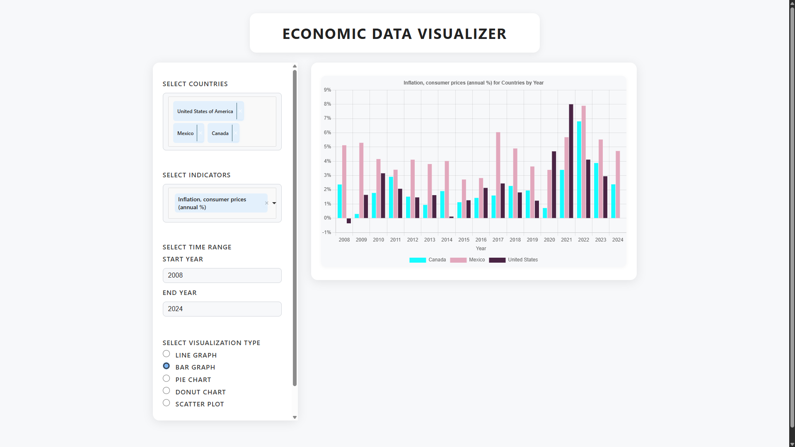
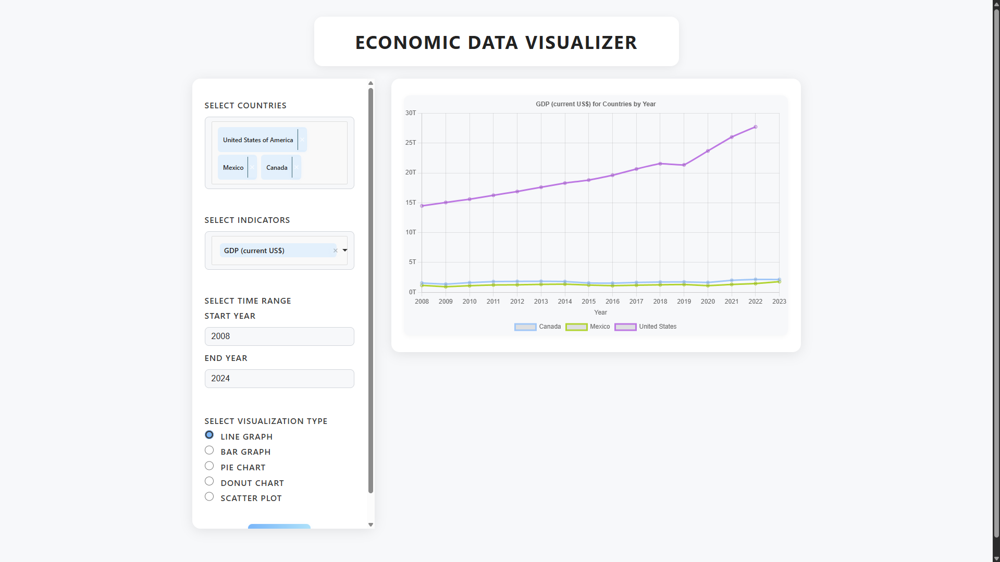
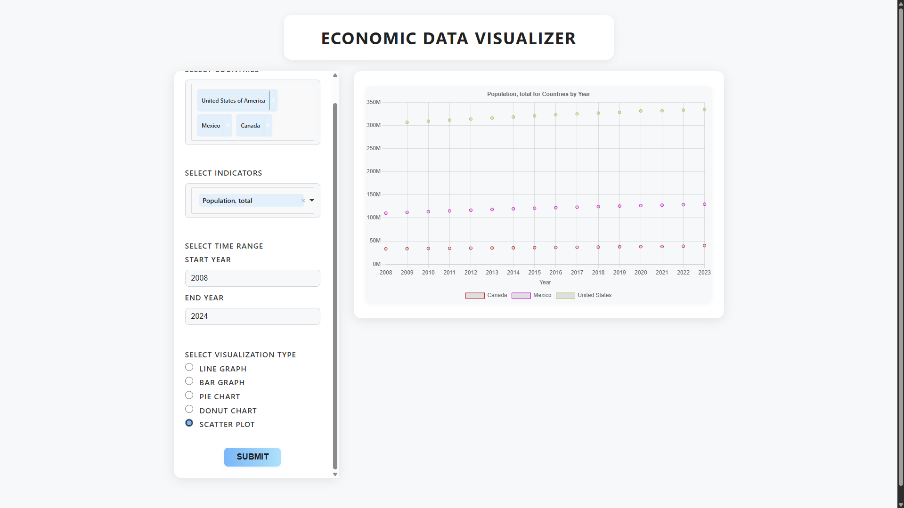

# Economic Data Visualizer

**Economic Data Visualizer** is a web application that fetches real-time economic indicators from the [World Bank API](https://data.worldbank.org/) and allows users to generate visual dashboards using [Chart.js](https://www.chartjs.org/). Users can select countries, economic indicators (like GDP), time ranges, and visualization types to explore data in an interactive and informative way.

## Features

- Select one or more countries to analyze
- Choose from a range of economic indicators (e.g., GDP, inflation, population)
- Set custom start and end years for your data range
- Visualize data using different chart types: bar graph, line chart, pie chart, scatter plot, and donut chart
- Built with Chart.js for sleek, responsive, and interactive visualizations
- Uses real-time data from the World Bank API

## Demo





## Technologies Used

- HTML, CSS, JavaScript
- Chart.js
- Choices.js
- World Bank API
- Node.js

## Installation

1. Clone the repository:
   ```bash
   git clone https://github.com/emhgit/economic-data-visualizer.git
   cd economic-data-visualizer
   ```
2. Install dependencies (if using npm):
   ```bash
   npm install
   ```
3. Open index.html in your browser to use the application.

## Usage

Select a country from the dropdown.

Choose an economic indicator (e.g., GDP).

Set the start and end year.

Select your preferred chart type.

Click "Submit" to generate the visualization.

## License

This project is licensed under the MIT License. See the [LICENSE](./LICENSE) file for details.

## Third-Party Libraries

This project uses the following libraries:

- Chart.js (MIT License) - https://github.com/chartjs/Chart.js
- Choices.js (MIT License) - https://github.com/Choices-js/Choices
